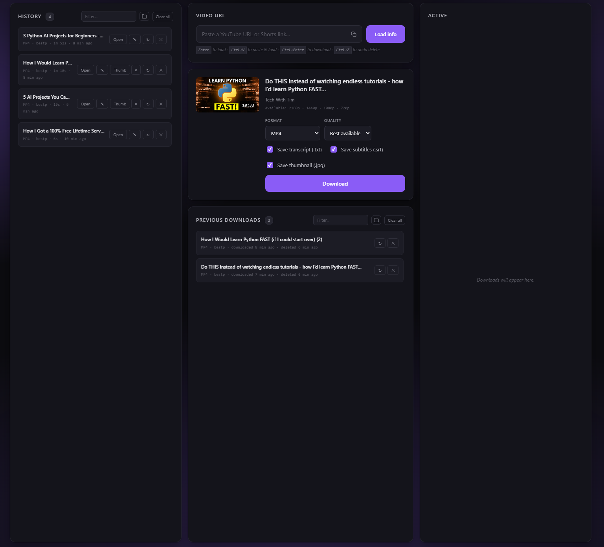
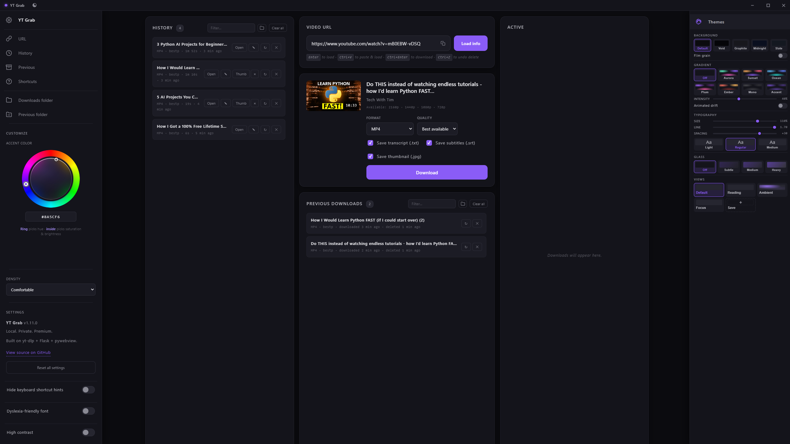
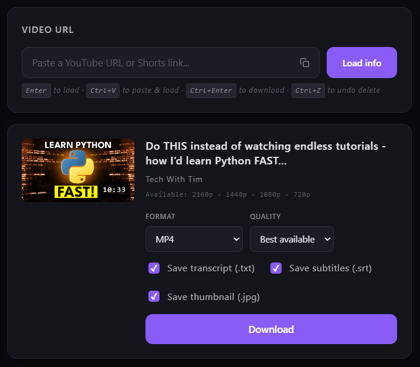
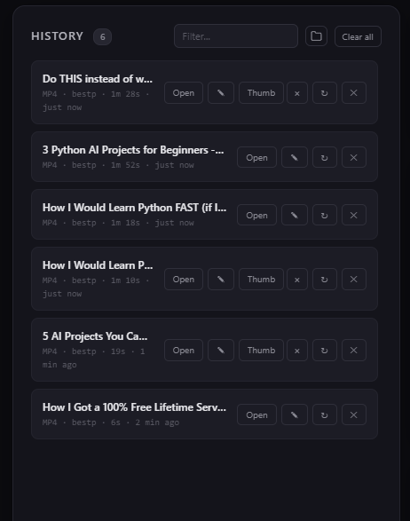
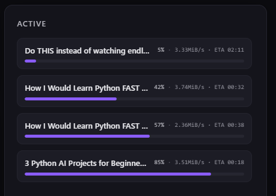
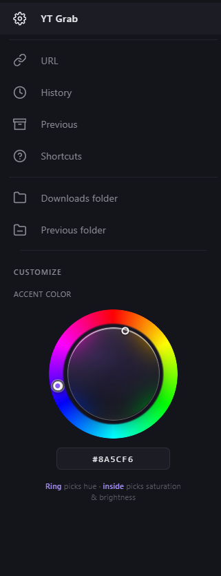
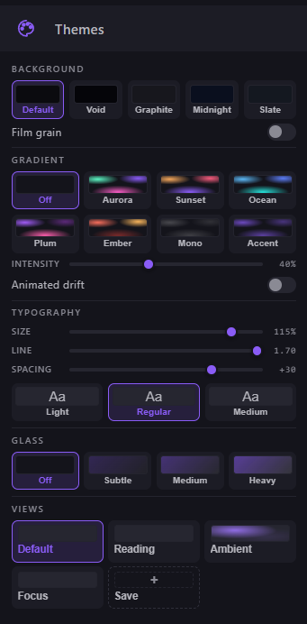
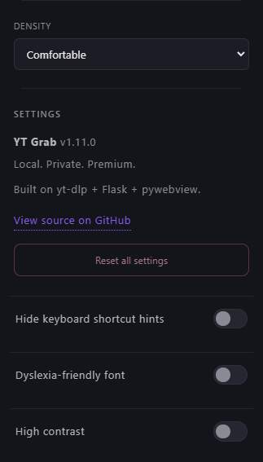

# YT Grab

A clean, local-first YouTube downloader for Windows. Native desktop window, premium dark UI, no tracking, no ads, no uploads. Your videos stay on your machine.


[](https://github.com/SIeepyDev/YT-Grab/releases/latest)


<p align="center">
  
</p>

## Features

- **Three-column workspace** — History (files on disk) on the left, paste + format picker in the middle with your Previous Downloads log beneath, and the Active queue on the right that fills the moment you hit download.
- **Every format** — MP4 / MKV / WEBM up to 4K (2160p VP9), plus MP3 / M4A / OPUS / WAV / FLAC with bitrate selection for lossy audio.
- **Embedded metadata + thumbnail** — downloads ship with cover art baked into the file.
- **Transcript + thumbnail sidecars** — optional `.txt` and `.jpg` alongside the video, one click to open / view / delete.
- **Rename from the UI** — F2, double-click the title, or the pencil button. Renames the folder and every file inside on disk.
- **Previous Downloads log** — once you delete something, it stays in the log so you can redownload with one click.
- **Ctrl+Z** — undoes the last delete (files come back from the Recycle Bin reference).
- **Themes panel** — right-side sidebar with Background, Gradient, Typography, Glass, and Saved Views sections. All dials live in a single 300 px drawer, none of them scroll at 768 p or above.
- **Title-bar mode toggle** — one-click cycle between Dark · Light · System without opening a panel. Icon swaps between moon · sun · monitor to match.
- **Left sidebar Settings** — accent color (HSV ring + hex), density, dyslexia-friendly font, high-contrast mode, hide-hints toggle, and Reset all settings. Everything persists across sessions via WebView2 localStorage, pinned to `%LOCALAPPDATA%\YTGrab\webview` so it survives renaming or moving the exe.
- **Native Windows integration** — pinned Start Menu + Desktop shortcuts, own taskbar identity, WebView2 under the hood (no Chrome required).

## Screenshots

The clean three-column workspace with no sidebars open — paste a URL on the left, format picker in the middle, queue on the right.

<p align="center">
  
</p>

Paste a URL → load info → pick a format → hit Download. Subtitles, transcript, and thumbnail sidecars are one checkbox each.

<p align="center">
  
</p>

History panel (files currently on disk) and the Active queue (downloads in flight, with per-item progress + ETA + speed).

| History | Active |
|---|---|
|  |  |

Left sidebar holds nav + the HSV accent-color picker. Themes (right sidebar) carries the visual dials — Background, Gradient, Typography, Glass, Views. Settings (bottom of left sidebar) is the about block + Import/Reset + the three a11y toggles.

| Left sidebar | Themes | Settings |
|---|---|---|
|  |  |  |

## Install (just use it)

1. Go to the [latest release](https://github.com/SIeepyDev/YT-Grab/releases/latest).
2. Under **Assets**, download **`YTGrab.exe`**. That's the one you want.
3. Double-click. A small setup window appears for a few seconds, installs YT Grab to `%LOCALAPPDATA%\Programs\YTGrab`, creates Desktop + Start Menu shortcuts (one for the app, one for uninstall), and launches the app.
4. From then on, launch YT Grab from the Desktop or Start Menu shortcut. Each launch does a silent update check; if a newer version is out, it downloads and swaps itself in before opening the app.

To uninstall, use the **"Uninstall YT Grab"** shortcut — it removes the install folder, shortcuts, and WebView2 cache. Optional export-to-Desktop beforehand if you want to keep your history.

The release page also ships **`YTGrabUninstaller.exe`** as a separate asset — identical to the one `YTGrab.exe` installs, just posted on its own for the rare case where the shortcut got deleted or the install folder is in a weird state and you need to run the cleaner directly. Most users never touch it.

GitHub auto-attaches `Source code (zip)` and `Source code (tar.gz)` to every release. Those are for developers cloning the repo and can be ignored.

## Quick start (source mode, dev-friendly)

Requires **Python 3.10+** on Windows.

```powershell
git clone https://github.com/SIeepyDev/YT-Grab.git
cd YT-Grab
.\launch.vbs
```

First launch creates a venv and installs requirements. Subsequent launches are silent and instant. Double-click `launch.vbs` from Explorer or pin the auto-created Start Menu shortcut.

For full metadata + thumbnail embedding, run `fetch_ffmpeg.bat` once — it downloads ffmpeg + ffprobe (~100 MB) into `bin/`. Without them, downloads still work; thumbnail-embed and transcode postprocessors skip gracefully.

## Build a standalone .exe

```powershell
.\build.bat
```

Runs three PyInstaller passes in order and leaves three files in `dist\`:

| File | Purpose |
|---|---|
| `YTGrabApp.exe` | The real Flask + pywebview app. Intermediate — bundled into `YTGrab.exe` below. Not a release asset. |
| `YTGrabUninstaller.exe` | Standalone tkinter uninstaller. Intermediate — bundled into `YTGrab.exe`. Not a release asset. |
| `YTGrab.exe` | **The single public download.** Bundles the two above as PyInstaller data resources, handles install + auto-update + shortcut creation. About 60-70 MB. |

```powershell
.\package.bat
```

Wraps `YTGrab.exe` plus a source-mode fallback into `dist\YTGrab.zip` (ships with a `FRIEND_README.txt` that explains both install paths). Send this zip to anyone with a recent Windows machine — they unzip and run.

### Smart App Control note

Windows 11's Smart App Control (SAC) blocks unsigned PyInstaller binaries on some machines with no "Run anyway" option. The packaged zip includes a `source/` fallback — run `source\launch.vbs` and it runs from Python just fine. SAC leaves Python scripts alone.

## What lives where

| Path | What |
|---|---|
| `server.py` | Flask backend + pywebview native window. Download pipeline, history, Explorer integration, Windows shortcut + taskbar branding. |
| `index.html` | Entire UI — HTML + CSS + JS in one file for simplicity. Dark theme with accent color CSS vars driven by the settings panel. |
| `installer.py` + `Installer.spec` | The outer `YTGrab.exe` (the single public download). Tkinter installer + auto-updater that bundles `YTGrabApp.exe` and `YTGrabUninstaller.exe` as data resources. |
| `uninstaller.py` + `Uninstaller.spec` | Standalone tkinter uninstaller built into `dist\YTGrabUninstaller.exe`, then bundled inside `YTGrab.exe`. |
| `YTGrab.spec` | PyInstaller spec for the inner `YTGrabApp.exe`. `console=False`, bundles icon + index.html + ffmpeg. |
| `launch.bat` | Verbose launcher (creates venv, installs reqs, kills zombie ports). |
| `launch.vbs` | Silent launcher. Default entry point for users. |
| `fetch_ffmpeg.bat` | One-time fetch of the full ffmpeg build (for thumbnail/metadata embed). |
| `build.bat` + `build_icon.py` | Three-pass build pipeline: `YTGrabApp.exe` → `YTGrabUninstaller.exe` → single `YTGrab.exe`. |
| `package.bat` | Wraps the single `YTGrab.exe` plus a source fallback into a shippable zip. |
| `clean.bat` | Factory reset — wipes venv, dist, bin, downloads, history. |
| `release.bat` / `release.ps1` | After `build.bat`, uploads `dist\YTGrab.exe` and `dist\YTGrabUninstaller.exe` as release assets. Requires `GH_PAT`. |
| `.github/workflows/release-please.yml` | Parses Conventional Commits on push to `main`, maintains a living release PR with the next version + changelog. Merge the PR → tag + GitHub Release land automatically. |
| `.release-please-manifest.json` | Single source of truth for the current version. Auto-bumped; the `<!-- x-release-please-version -->` marker in `index.html` stays in sync. |
| `downloads/` | User-facing output. Per-video folders with the main file + optional sidecars. |
| `history.json` | Current on-disk downloads. |
| `activity.json` | Log of everything ever downloaded (including deleted). |
| `settings.json` | User preferences from the settings panel. |

## Architecture


- **Flask** serves `/api/*` JSON endpoints on `localhost:8765`.
- **pywebview + WebView2** wraps the page as a native desktop window (no Chrome dependency, own taskbar identity).
- **yt-dlp** handles the actual extraction and format negotiation with YouTube.
- **ffmpeg + ffprobe** (in `bin/`) handle transcoding, thumbnail conversion, metadata embed.
- **send2trash** makes delete reversible — files go to the Recycle Bin.
- **comtypes** + Shell.Application COM powers the "reuse existing Explorer window" behavior when you hit Open.

The Flask server runs in a background thread; the main thread is pywebview. A heartbeat loop on the frontend + `navigator.sendBeacon('/api/shutdown')` on tab close means closing the window exits the process — no zombies.

## Shipping a new version

Shipping is automated by [release-please](https://github.com/googleapis/release-please). No local ship scripts, no manual tag pushes — just commit in the [Conventional Commits](https://www.conventionalcommits.org) style and merge the release PR.

1. Make your changes. Commit with a prefix that tells release-please what kind of bump to apply:
    - `feat: add Ctrl+K command palette` — minor bump (1.4.0 → 1.5.0), lands under **Features** in the changelog.
    - `fix: gradient animation never stops` — patch bump (1.4.0 → 1.4.1), lands under **Bug Fixes**.
    - `feat!: drop Python 3.9 support` or a footer of `BREAKING CHANGE: ...` — major bump.
    - `chore:` / `ci:` / `test:` / `style:` — no bump, hidden from the changelog (use these for non-user-facing maintenance).
2. Push to `main`. The `release-please` workflow opens (or updates) a pull request titled something like **chore(main): release 1.5.0**. It contains the computed version bump and an auto-generated `CHANGELOG.md` entry.
3. Review the release PR. Edit the changelog body if you want to humanize the entries — release-please respects manual edits inside the release PR.
4. Merge the release PR. That's the ship — release-please tags `v1.5.0`, updates `.release-please-manifest.json`, bumps the `x-release-please-version` marker in `index.html`, and publishes a GitHub Release with the changelog as the body.

> Note: the commit format is enforced by convention, not tooling — release-please silently ignores commits that don't match, and those changes won't appear in the next changelog. Keep subjects ≤50 characters, imperative mood, no trailing period.

After release-please publishes the Release, run `.\build.bat` then `.\release.bat` (requires `GH_PAT`) to attach `YTGrab.exe` and `YTGrabUninstaller.exe` as downloadable assets. The intermediate `YTGrabApp.exe` stays in `dist\` and does not get uploaded — it lives inside `YTGrab.exe`.

## Privacy

- Zero telemetry.
- No remote API calls other than YouTube itself (via yt-dlp).
- Nothing leaves your machine except the video fetch from YouTube's CDN.
- History and activity logs are local JSON files you can delete or inspect.

## Known limitations

- **Windows only.** The pywebview + WebView2 + Win32 taskbar integration is Windows-specific. Cross-platform support is not a near-term goal.
- **Smart App Control can block the signed-less .exe** — fall back to source mode.
- **yt-dlp moves fast.** If YouTube ships a breaking extractor change, run `launch.bat` — it auto-upgrades yt-dlp on each start.

## License

Free to use. See [LICENSE](LICENSE) for the full notice.

## Author

Built by [SleepyDev](https://github.com/SIeepyDev).

## Changelog

Full release notes live on [the Releases page](https://github.com/SIeepyDev/YT-Grab/releases). See [`CHANGELOG.md`](CHANGELOG.md) for the machine-generated log.
