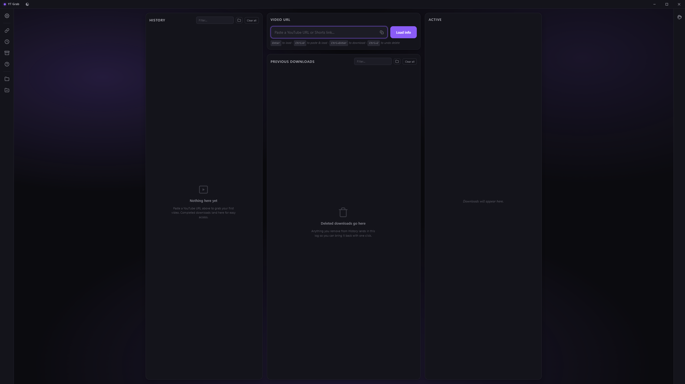
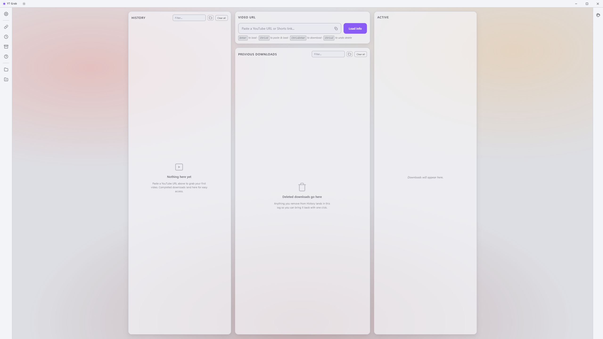
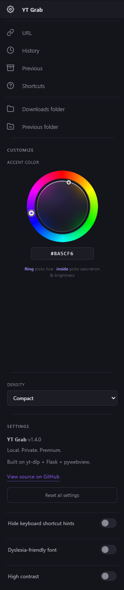
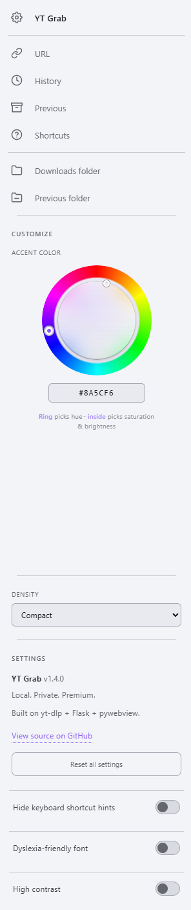
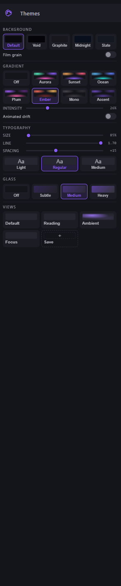
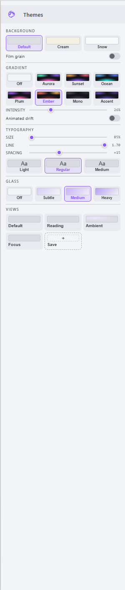
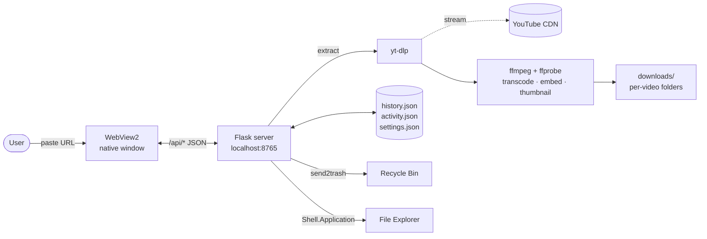

# YT Grab

A clean, local-first YouTube downloader for Windows. Native desktop window, premium dark UI, no tracking, no ads, no uploads. Your videos stay on your machine.


[](https://github.com/SIeepyDev/yt-grab/releases/latest)


<p align="center">
  
</p>

## Features

- **Three-column workspace** — History (files on disk) on the left, paste + format picker in the middle with your Previous Downloads log beneath, and the Active queue on the right that fills the moment you hit download.
- **Every format** — MP4 / MKV / WEBM up to 4K (2160p VP9), plus MP3 / M4A / OPUS / WAV / FLAC with bitrate selection for lossy audio.
- **Embedded metadata + thumbnail** — downloads ship with cover art baked into the file.
- **Transcript + thumbnail sidecars** — optional `.txt` and `.jpg` alongside the video, one click to open / view / delete.
- **Rename from the UI** — F2, double-click the title, or the pencil button. Renames the folder and every file inside on disk.
- **Previous Downloads log** — once you delete something, it stays in the log so you can redownload with one click.
- **Ctrl+Z** — undoes the last delete (files come back from the Recycle Bin reference).
- **Themes panel** — right-side sidebar with Background, Gradient, Typography, Glass, and Saved Views sections. All dials live in a single 300 px drawer, none of them scroll at 768 p or above.
- **Title-bar mode toggle** — one-click cycle between Dark · Light · System without opening a panel. Icon swaps between moon · sun · monitor to match.
- **Left sidebar Settings** — accent color (HSV ring + hex), density, dyslexia-friendly font, high-contrast mode, hide-hints toggle, and Reset all settings. Everything persists across sessions via WebView2 localStorage, pinned to `%LOCALAPPDATA%\YTGrab\webview` so it survives renaming or moving the exe.
- **Native Windows integration** — pinned Start Menu + Desktop shortcuts, own taskbar identity, WebView2 under the hood (no Chrome required).

## Screenshots

|  | Dark | Light |
|---|---|---|
| **Default view** |  |  |
| **Settings (left sidebar)** |  |  |
| **Themes (right sidebar)** |  |  |

Default view shows the three-column workspace (History · Paste + Previous Downloads · Active queue) with the title-bar mode toggle to the right of the brand. Settings sidebar exposes the accent-color HSV ring, density, and the three iOS-style toggles (hide hints, dyslexia-friendly font, high contrast). Themes sidebar carries the visual dials — Background · Gradient · Typography · Glass · Saved views.

## Quick start (source mode, dev-friendly)

Requires **Python 3.10+** on Windows.

```powershell
git clone https://github.com/SIeepyDev/yt-grab.git
cd yt-grab
.\launch.vbs
```

First launch creates a venv and installs requirements. Subsequent launches are silent and instant. Double-click `launch.vbs` from Explorer or pin the auto-created Start Menu shortcut.

For full metadata + thumbnail embedding, run `fetch_ffmpeg.bat` once — it downloads ffmpeg + ffprobe (~100 MB) into `bin/`. Without them, downloads still work; thumbnail-embed and transcode postprocessors skip gracefully.

## Build a standalone .exe

```powershell
.\build.bat
```

Produces `dist\YTGrab.exe` — a single-file Windows binary with Python, every dependency, and ffmpeg bundled in. No install, no dependencies for the end user. About 60 MB.

```powershell
.\package.bat
```

Wraps the exe plus a source fallback into `dist\YTGrab.zip` (ships with a `FRIEND_README.txt` that explains both modes). Send this zip to anyone with a recent Windows machine — they unzip and run.

### Smart App Control note

Windows 11's Smart App Control (SAC) blocks unsigned PyInstaller binaries on some machines with no "Run anyway" option. The packaged zip includes a `source/` fallback — run `source\launch.vbs` and it runs from Python just fine. SAC leaves Python scripts alone.

## What lives where

| Path | What |
|---|---|
| `server.py` | Flask backend + pywebview native window. Download pipeline, history, Explorer integration, Windows shortcut + taskbar branding. |
| `index.html` | Entire UI — HTML + CSS + JS in one file for simplicity. Dark theme with accent color CSS vars driven by the settings panel. |
| `YTGrab.spec` | PyInstaller spec. `console=False`, bundles icon + index.html + ffmpeg. |
| `launch.bat` | Verbose launcher (creates venv, installs reqs, kills zombie ports). |
| `launch.vbs` | Silent launcher. Default entry point for users. |
| `fetch_ffmpeg.bat` | One-time fetch of the full ffmpeg build (for thumbnail/metadata embed). |
| `build.bat` + `build_icon.py` | Build pipeline for the .exe. |
| `package.bat` | Wraps exe + source fallback into a shippable zip. |
| `clean.bat` | Factory reset — wipes venv, dist, bin, downloads, history. |
| `backfill_tags.bat` / `backfill_tags.ps1` | One-time retroactive tagger — walks `git log`, tags every `vX.X:` commit, pushes. Double-click the `.bat`. |
| `.github/workflows/release-please.yml` | Parses Conventional Commits on push to `main`, maintains a living release PR with the next version + changelog. Merge the PR → tag + GitHub Release land automatically. |
| `.release-please-manifest.json` | Single source of truth for the current version. Auto-bumped; the `<!-- x-release-please-version -->` marker in `index.html` stays in sync. |
| `downloads/` | User-facing output. Per-video folders with the main file + optional sidecars. |
| `history.json` | Current on-disk downloads. |
| `activity.json` | Log of everything ever downloaded (including deleted). |
| `settings.json` | User preferences from the settings panel. |

## Architecture



- **Flask** serves `/api/*` JSON endpoints on `localhost:8765`.
- **pywebview + WebView2** wraps the page as a native desktop window (no Chrome dependency, own taskbar identity).
- **yt-dlp** handles the actual extraction and format negotiation with YouTube.
- **ffmpeg + ffprobe** (in `bin/`) handle transcoding, thumbnail conversion, metadata embed.
- **send2trash** makes delete reversible — files go to the Recycle Bin.
- **comtypes** + Shell.Application COM powers the "reuse existing Explorer window" behavior when you hit Open.

The Flask server runs in a background thread; the main thread is pywebview. A heartbeat loop on the frontend + `navigator.sendBeacon('/api/shutdown')` on tab close means closing the window exits the process — no zombies.

## Shipping a new version

Shipping is automated by [release-please](https://github.com/googleapis/release-please). No local ship scripts, no manual tag pushes — just commit in the [Conventional Commits](https://www.conventionalcommits.org) style and merge the release PR.

1. Make your changes. Commit with a prefix that tells release-please what kind of bump to apply:
    - `feat: add Ctrl+K command palette` — minor bump (1.4.0 → 1.5.0), lands under **Features** in the changelog.
    - `fix: gradient animation never stops` — patch bump (1.4.0 → 1.4.1), lands under **Bug Fixes**.
    - `feat!: drop Python 3.9 support` or a footer of `BREAKING CHANGE: ...` — major bump.
    - `chore:` / `ci:` / `test:` / `style:` — no bump, hidden from the changelog (use these for non-user-facing maintenance).
2. Push to `main`. The `release-please` workflow opens (or updates) a pull request titled something like **chore(main): release 1.5.0**. It contains the computed version bump and an auto-generated `CHANGELOG.md` entry.
3. Review the release PR. Edit the changelog body if you want to humanize the entries — release-please respects manual edits inside the release PR.
4. Merge the release PR. That's the ship — release-please tags `v1.5.0`, updates `.release-please-manifest.json`, bumps the `x-release-please-version` marker in `index.html`, and publishes a GitHub Release with the changelog as the body.

> Note: the commit format is enforced by convention, not tooling — release-please silently ignores commits that don't match, and those changes won't appear in the next changelog. Keep subjects ≤50 characters, imperative mood, no trailing period.

First-time setup: double-click `backfill_tags.bat` once to retroactively tag every historical `vX.X:` commit and push them all at once. Those tags pre-populate the Releases page with the full project history before release-please takes over.

## Privacy

- Zero telemetry.
- No remote API calls other than YouTube itself (via yt-dlp).
- Nothing leaves your machine except the video fetch from YouTube's CDN.
- History and activity logs are local JSON files you can delete or inspect.

## Known limitations

- **Windows only.** The pywebview + WebView2 + Win32 taskbar integration is Windows-specific. Cross-platform support is not a near-term goal.
- **Smart App Control can block the signed-less .exe** — fall back to source mode.
- **yt-dlp moves fast.** If YouTube ships a breaking extractor change, run `launch.bat` — it auto-upgrades yt-dlp on each start.

## License

[MIT](LICENSE). Use it, fork it, ship it, steal ideas. Attribution appreciated but not required.

## Author

Built by [SleepyDev](https://github.com/SIeepyDev). Part of the Luna workspace tools family.

## Changelog

### v1.5 — Layout polish + persistent settings (2026-04)

Pass focused on everything *around* the themebar rather than adding new dials. The goal was getting the UI out of its own way: fewer panels, tighter layout, and settings that actually survive a reinstall.

**Dark/Light/System moved to the title bar**
- The themebar no longer has a Mode section. A single 24 × 24 icon button sits next to the "YT Grab" brand in the title bar and cycles **Dark → Light → System** on click. Icon swaps between moon / sun / monitor so the current mode is readable from anywhere in the app.
- Frees ~75 px of vertical space in the themebar sidebar and removes a redundant "open drawer to change brightness" step.

**Accessibility toggles moved to the left sidebar**
- **Dyslexia-friendly font** and **High contrast** used to live in the Typography section. They're global preferences, not visual theme knobs — so they now stack with Hide-hints at the bottom of the left sidebar's Settings cluster, as iOS-style switches.
- Themebar sidebar stays focused on purely visual customization; accessibility lives with the other global preferences (density, reset, about).

**Background grid fits cleanly**
- Dark mode shows 5 swatches (Default, Void, Graphite, Midnight, Slate) in a single row; light mode shows 3 (Default, Cream, Snow) in a single row. No more orphan Slate wrapping to row two.
- Uses a mode-conditional CSS grid — `html[data-theme="light"] .bg-presets { grid-template-columns: repeat(3, 1fr); }` — so the picker always hugs its contents.

**Breathing room restored**
- The v1.4 compaction pass was over-eager. ~18 px of padding reinstated across section headers, toggle rows, and the themebar body. Still fits no-scroll at 1080 p / 900 p / 768 p.

**Settings survive packaging**
- pywebview's `storage_path` is now pinned to `%LOCALAPPDATA%\YTGrab\webview` with `private_mode=False`. Without this, WebView2 derives the localStorage path from the running process name, so `python server.py` and a packaged `YTGrab.exe` would look at different directories and lose settings between them. Every dial (accent, background, gradient, typography, glass, saved views, a11y toggles, density, hide-hints) now round-trips cleanly through close-and-reopen on both the source run and the frozen exe.

**Under the hood**
- Removed the dead `.mode-grid` / `.mode-card` CSS (~20 lines) and the `_syncThemeModeCards()` function + 4 call sites. The title-bar `_syncTbModeIcon()` covers the same responsibility in a third of the code.
- Ship scripts (`ship.bat`, `ship.ps1`) and the old `.github/workflows/release.yml` are gone — [release-please](https://github.com/googleapis/release-please) handles versioning and GitHub Releases from Conventional Commits now. See **Shipping a new version** above.

### v1.4 — Saved Views + Command Palette (2026-04)

The themebar grew to ten dials over v1.2 and v1.3. v1.4 is the personalization release: save any combination of those dials as a reusable "view," open a command palette to hit anything from the keyboard, and flip on a high-contrast mode for readability.

**Saved Views**
- New Themes panel section. Four built-in presets — **Default** (clean slate), **Reading** (larger text, looser line-height, gradient off), **Ambient** (accent gradient + medium glass + animated drift), **Focus** (graphite background, nothing moving, nothing frosted).
- **Save current view** button captures every themebar setting (theme mode, background, gradient, typography, glass, high-contrast) as a named snapshot.
- Custom presets are deletable via the X on hover. Built-ins are immutable.
- Each card previews its own mesh gradient at its own intensity — what you see is what you'll get when you click it.

**Command palette (Ctrl+K)**
- New keyboard-driven launcher. Fuzzy-matches every themebar control, every saved view, and common actions (paste URL, load info, open downloads folder, undo delete, clear history, focus URL input, show shortcuts).
- Arrow keys navigate, Enter executes, Esc closes. Hover or click works too.
- Grouped by section (Theme, Background, Gradient, Typography, Glass, Accessibility, Views, Actions, Navigate) so results stay scannable even at a glance.
- Frosted backdrop, scale-in transition, centered 560 px modal — matches the v1.3 glass aesthetic.

**Accessibility**
- New **High contrast** toggle in the themebar. Flips `html[data-contrast="high"]`, which kills gradient + glass, thickens all borders to 2 px, and bumps hint text from `--text-4` to `--text-2`. Pairs with the Dyslexia-friendly font for a maximum-readability configuration.
- **Focus rings** now use `:focus-visible` consistently across every interactive surface (buttons, inputs, preset cards, view cards, toggles, palette items). Invisible for mouse users, visible for keyboard users. 2 px ring normally, 3 px in high-contrast mode.

**Under the hood**
- `VIEW_KEYS` defines the "what counts as a look" contract in one place — views capture exactly these keys, so adding a new themebar dial later is a one-line addition.
- Command registry rebuilt on every palette open so dynamic items (user-created views, newly-added actions) stay current.
- `_cmdkScore` is a simple substring-plus-word-break ranker. No fuzzy-match dependency, no token index — it's fast enough at the 40-command scale and easy to read.

### v1.3 — Typography + Glass (2026-04)

Two new themebar sections. The theme system is now less "pick a color" and more "dial in a reading environment."

**Typography**
- **Size slider** — 85 %–120 % of the 14 px body base. Drives a `--font-scale` CSS token; everything inheriting from body scales together.
- **Line slider** — 1.30–1.70 line-height, shown as the float value (e.g. `1.50`).
- **Spacing slider** — character spacing from `0` to `+40` (1/1000 em). Tightens or opens text without touching size.
- **Weight picker** — Light 300 / Regular 400 / Medium 500 preset cards, each with an `Aa` preview at the actual weight.
- **Dyslexia-friendly toggle** — swaps the UI font to Verdana (wide x-height, distinct letterforms, on every Windows machine). Atkinson Hyperlegible is a secondary fallback if the system happens to have it.

**Glass**
- Four presets: **Off / Subtle / Medium / Heavy**. Each maps to a (blur, tint) pair — `0 / 1.00`, `8 / 0.85`, `16 / 0.70`, `24 / 0.55`.
- `.card` background now uses `rgba(var(--bg-1-rgb), var(--glass-tint))` so the tint dials opacity without losing theme color, and `backdrop-filter: blur(var(--glass-blur)) saturate(1.15)` frosts whatever sits behind (gradient mesh, film grain, the canvas itself).
- Works best with a gradient enabled — inline hint line says so.

**Layered shadow tokens**
- New `--shadow-card` replaces the old single 12 px drop. Composite of a tight 1-2 px close shadow and a soft 24 px far shadow — crisp on any background including noisy or gradient canvases.
- Light theme overrides with gentler values. Per-component light-mode shadow override removed (the token handles it).

**Under the hood**
- Every v1.3 control is a CSS custom property or one `data-dyslexia` attribute on `<html>`. No per-element JS styling.
- New settings: `fontScale`, `lineHeight`, `letterSpacing`, `fontWeight`, `dyslexiaFont`, `glassMode`. Migration-safe via the existing spread-merge.

### v1.2.2 — Themebar polish (2026-04)

- **Layout section removed.** Classic was the winner — Focus was too subtle, Stacked never felt right on wide monitors. Killing choice here removes the three preset cards, the column-visibility chips, and ~50 lines of CSS. Page grid is back to the clean 3-column default, no branching.
- **Background section** now uses labeled preset cards (same primitive as Gradient) so every option has a name underneath instead of hover-only tooltips on unlabeled circles. Filtered by theme mode: Void / Graphite / Midnight / Slate show in Dark, Cream / Snow in Light. You only see relevant options.
- **Film grain** gets an inline hint: *"Subtle analog noise overlay on the canvas. Adds depth without affecting contrast."*
- **Gradient intensity** readout now shows a `%` suffix. Inline hint: *"How visible the mesh is. 0% hides it, 100% is full-bleed."*
- **Animated drift** gets an inline hint: *"Slow ~40s orbit — colors drift gently like a lava lamp. Off by default."*

### v1.2.1 — Layout preset fix (2026-04)

- **Focus** is now dramatic instead of subtle — sides become fixed 280 px slim rails and the middle column takes all remaining width. On a 1920 px window the middle goes from ~750 px (Classic) to ~1260 px.
- **Stacked** is now a true single-column view, capped at 820 px and centered. `grid-template-areas` reorders children so URL paste lands at the top, History below it, Active at the bottom.
- Tall cards in Stacked mode stop trying to flex-fill the viewport and cap at 360 px internal scroll. Body scroll-lock unlocks in Stacked since the stacked column is usually taller than 100 vh.

### v1.2 — Theming Polish (2026-04)

Themebar grew up. The right-side Themes panel is no longer a gear with a color picker — it's a proper personalization surface with four sections: Theme mode, Layout, Background, and Gradient.

**Theme mode**
- Three-card picker: **Light**, **Dark**, **System**. System listens to `prefers-color-scheme` and follows your OS live — flip Windows' theme and the app flips with it, no restart.
- Switching modes now *transitions* instead of snapping. 380 ms cubic-bezier cross-fade on background, text, borders, and accent surfaces. Respects `prefers-reduced-motion`.

**Layout section**
- Three layout presets: **Balanced** (default three-column), **Focus** (middle column wider, sides slimmer for when you're paste-and-going), **Stacked** (single-column flow for narrow windows or screenshots).
- Per-column visibility toggles for History / Middle / Queue. Hide what you don't use.

**Background section**
- Seven base backgrounds across both modes: Void, Graphite, Midnight, Slate for dark; Cream, Paper, Snow for light.
- Optional subtle noise overlay — adds film-grain texture without affecting contrast.

**Gradient section**
- Six gradient presets: Aurora, Sunset, Ocean, Plum, Ember, plus **Accent-derived** (auto-generates a mesh from your current accent color).
- Gradient intensity slider (0–100 %) and optional slow animation that orbits the hue field over ~40 s.

**Under the hood**
- Accent palette now derives from a single hex via `color-mix(in oklch, …)` — `--accent`, `--accent-hover`, `--accent-subtle`, `--accent-text`, and `--accent-contrast` stay perceptually consistent across the full color range. No more muddy-looking hovers on amber or lime.
- Auto-contrast text: buttons and badges on accent backgrounds pick black or white automatically based on Rec. 709 luminance. Pastel accents flip to dark text, dark accents stay white-on-accent.
- Every themebar control is a single `data-*` attribute on `<html>` — CSS does the work, JS just toggles an attribute. Fast and declarative.
- New settings persisted across sessions: `layoutPreset`, `colsVisible`, `bgPreset`, `bgNoise`, `gradientPreset`, `gradientIntensity`, `gradientAnimate`.

**Also in this release**
- Color picker inner disc is now true Liquid Glass — transparent, fitted within the hue ring, frosted with `backdrop-filter: blur(18px) saturate(1.4)`. Feels like Apple's material, not a solid JS-painted gradient.

### v1.1 — Batch, subtitles, context menu (2026-04)

- **Playlist support** — paste a playlist URL, get a picker modal with thumbnails and checkboxes. Select all / none / individual, queues via the batch pipeline.
- **Subtitles (.srt)** — new "Save subtitles" checkbox. Requests both human-authored and auto-generated English captions. New Subs combo-button on history rows.
- **Right-click context menu on history rows** — Copy URL, Open on YouTube, Reveal in folder, Rename, Redownload, Delete.
- **Clipboard auto-detect** — copy a YouTube URL anywhere, return to YT Grab, URL auto-fills with a "Enter to load" hint.
- **Multi-URL batch paste** — paste newline-separated YouTube URLs, they all queue.
- **Keyboard shortcuts** — press `?` for cheatsheet, `Ctrl+,` opens settings.
- Page scroll locked, only cards scroll internally. 14-color accent palette (was 6). Dark Windows title bar via DWM immersive. Flicker-free launch.
- New `/api/playlist_info` endpoint uses yt-dlp `flat_playlist` for ~1 s listing of 50 videos (vs ~30 s with per-video probe).

### v1.0 — Initial prototype

Three-column workspace, every format up to 4K, embedded metadata + thumbnail, transcript + thumbnail sidecars, rename-on-disk, Previous Downloads log, Ctrl+Z undo, native Windows integration.
